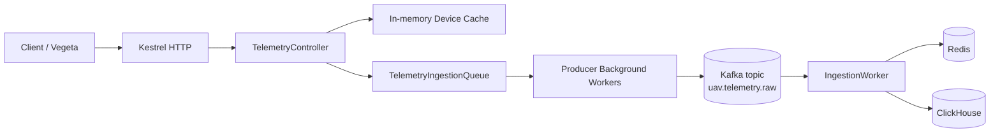
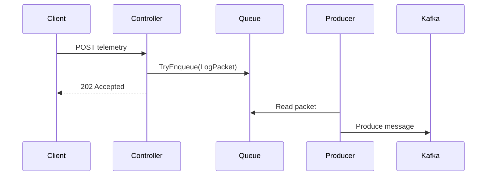
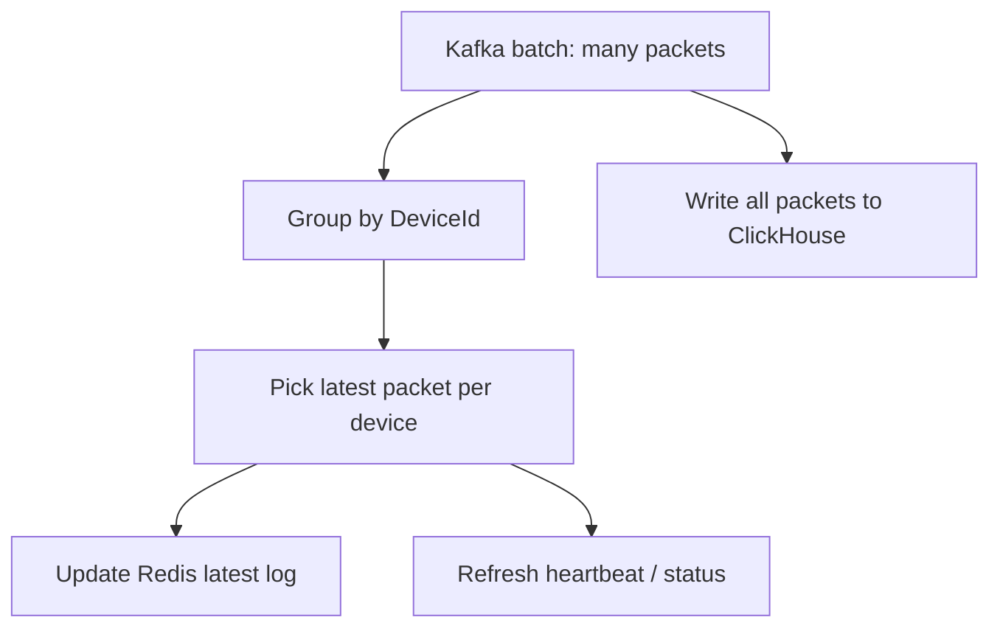

# Homework: Tăng tải trên Service nhận telemetry

## 1. Mục tiêu

Hiện tại service nhận telemetry của em xử lí được khoảng 3000 request/s và hệ thống sẽ chạy chậm hơn khi cho lên 10000 request/s. Do đó yêu cầu là phải tối ưu service nhận telemetry của em sao cho có thể xử lí được trên 20000 request/s.

Phạm vi: Homework của em chỉ tối ưu phần service nhận telemetry để đạt hiệu suất tối đa, không động tới scale thêm nhiều instance của service nhận telemetry không được tính.

## 2. Điểm yếu của code cũ (anh có thể check lại trong branch kafka):

```text
HTTP request -> TelemetryController -> Kafka Produce -> Kafka -> IngestionWorker -> Redis / ClickHouse
```

### 2.1 Controller lam qua nhieu viec tren hot path

Code cu xu ly gan nhu toan bo tren request path:

```text
HTTP request
  -> JSON model binding
  -> Redis KeyExistsAsync
  -> tao LogPacket
  -> serialize JSON
  -> Kafka Produce
  -> log per request
  -> return 202
```

Van de:

- Moi request phai cho Redis network I/O.
- Moi request phai serialize JSON truoc khi tra response.
- Moi request goi Kafka producer truc tiep, co the bi anh huong boi Kafka backpressure.
- Logging theo tung packet tao overhead lon o muc 10k-20k TPS.
- Response co body JSON lam tang allocation va bytes tra ve.

### 2.2 Redis validation bi lap lai qua nhieu

Code cu kiem tra device ton tai bang Redis cho tung request:

```csharp
var metaKey = RedisKeys.DeviceMeta(payload.DeviceId);
bool deviceExists = await _redis.KeyExistsAsync(metaKey);
```

Neu 1 thiet bi gui 20k telemetry/s, service co the tao 20k Redis lookup/s chi de kiem tra cung mot key.

Day la bottleneck I/O, khong nhat thiet lam CPU len 100%, nhung lam latency tang va request bi xep hang.

### 2.3 Kafka publish nam truc tiep trong HTTP request

Code cu:

```csharp
_kafkaProducer.Produce("uav.telemetry.raw", new Message<string, string>
{
    Key = payload.DeviceId.ToString(),
    Value = jsonPacket
});
```

Mac du `Produce` khong doi broker ack nhu `ProduceAsync`, no van co the bi anh huong khi local librdkafka queue day hoac producer gap backpressure. Khi Kafka cham, HTTP latency cung bi keo theo.

### 2.4 IngestionWorker xu ly Redis theo tung packet

Worker cu co the check status va update heartbeat theo tung telemetry packet. Voi batch lon, neu nhieu packet cung thuoc mot device, Redis work bi lap lai khong can thiet.

Vi du:

```text
20,000 packet trong batch
1 device
```

Code cu van co the tao hang nghin Redis status/heartbeat operations cho cung mot device.

### 2.5 Benchmark Python gay hieu nham

`async_benchmark.py` dung Python asyncio de tao nhieu task. No co gang schedule burst lon, nhung khong chung minh duoc request that su di ra network du 10k/s.

Ngoai ra:

```text
HTTP 0 = client timeout / network failure
Actual RPS = response completed per second, khong phai request sent per second
```

Do do can dung load generator manh hon nhu Vegeta de test HTTP throughput.

## 2. Kiến trúc hiện tại

## 3. Kien truc moi sau toi uu

### 3.1 Flow tong quat



### 3.2 Controller chi accept nhanh

Controller moi chi lam cac viec toi thieu:

```text
validate DeviceId
check in-memory device cache
map payload -> LogPacket
enqueue vao TelemetryIngestionQueue
return empty 202
```

Kafka publish khong con nam tren HTTP request path.

### 3.3 Tach Kafka producer sang background worker

Flow moi:

```text
TelemetryController -> TelemetryIngestionQueue -> Producer -> Kafka
```

`Producer` doc tu queue va publish Kafka o background. Dieu nay giup HTTP request khong bi phu thuoc truc tiep vao Kafka latency.

### 3.4 Dung in-memory queue lam buffer cuc bo

`TelemetryIngestionQueue` la bounded channel:

```text
HTTP thread ghi nhanh vao queue
Producer worker doc queue va day sang Kafka
```

Loi ich:

- Hap thu burst ngan han.
- Giam latency cua HTTP request.
- Tach toc do accept request khoi toc do Kafka publish.

Trade-off:

- Message da return `202` nhung con nam trong memory queue co the mat neu process crash truoc khi publish Kafka.
- Neu can durability tuyet doi, phai publish Kafka truoc khi return 202, nhung throughput HTTP se thap hon.

## 4. Cac ky thuat toi uu da ap dung

### 4.1 Asynchronous buffering

Thay vi xu ly truc tiep trong request, service dung buffer:

```text
HTTP accept -> queue -> background processing
```

Day la pattern pho bien cho high-throughput ingestion.

### 4.2 Producer-consumer pattern

Controller la producer cua local queue. `Producer` background service la consumer cua queue va producer cua Kafka.



### 4.3 Device existence cache

Controller su dung in-memory cache theo `deviceId`:

```text
positive TTL: 5 phut
negative TTL: 5 giay
```

Tac dung:

- Giam Redis call tren hot path.
- Request lap lai tu cung device gan nhu khong cham Redis.

### 4.4 Cache stampede protection

Neu nhieu request cung luc miss cache cho cung mot `deviceId`, chi mot request duoc di Redis, cac request con lai doi ket qua cache.

Tac dung:

- Giam spike Redis o burst dau.
- On dinh latency khi warm-up.

### 4.5 Bo per-request success logging

Logging moi request o 20k TPS tao overhead lon:

```text
20k log lines/s -> console/file sink tro thanh bottleneck
```

Code moi khong log success tung packet tren hot path, chi log warning/error can thiet.

### 4.6 Empty 202 response

Thay vi return object JSON:

```json
{ "device_id": 1001, "status": "queued" }
```

Controller tra:

```text
HTTP 202 with empty body
```

Tac dung:

- Giam serialization.
- Giam allocation.
- Giam bytes tra ve.

### 4.7 Batch-aware Redis update trong IngestionWorker

Worker moi van ghi tat ca telemetry vao ClickHouse, nhung Redis update duoc collapse theo latest packet moi device trong batch.



Vi du:

```text
20,000 packets / batch
1 device
```

Redis latest/status work:

```text
Truoc: co the gan 20,000 operations
Sau: gan 1 operation moi loai cho device do
```

### 4.8 Static JsonSerializerOptions

Thay vi tao `JsonSerializerOptions` moi lan deserialize Kafka message, worker dung static options.

Tac dung:

- Giam allocation.
- Giam GC pressure.

### 4.9 Await Redis batch tasks truoc khi commit Kafka

Worker moi doi Redis batch tasks hoan tat truoc khi commit Kafka offset.

Tac dung:

- An toan hon cho pipeline.
- Commit offset chi sau khi cac buoc xu ly quan trong da xong.

## 5. Ket qua benchmark va cach dien giai

Vegeta result:

```text
Requests      [total, rate, throughput]  630001, 21007.39, 21006.70
Latencies     p99                        ~12ms
Success       ratio                      100%
Status Codes                             202
```

Dien giai dung:

```text
HTTP accept layer dat khoang 21k req/s voi 100% 202.
```

Khong nen dien giai ngay la:

```text
ClickHouse da ghi xong 21k rows/s.
```

Muon ket luan end-to-end, can kiem tra them:

```text
Kafka consumer lag = 0
ClickHouse row count tang dung voi request count
Memory IngestionService on dinh
Kafka offset tang theo request count
```

## 6. Cach kiem tra backlog phia sau

### 6.1 Kafka consumer lag

```powershell
docker exec -it uav-kafka kafka-consumer-groups --bootstrap-server localhost:9092 --describe --group ingestion-worker-group
```

Can thay:

```text
CURRENT-OFFSET = LOG-END-OFFSET
LAG = 0
```

Neu lag tang lien tuc:

```text
IngestionWorker / ClickHouse khong theo kip.
```

### 6.2 Kafka offset

```powershell
docker exec -it uav-kafka kafka-run-class kafka.tools.GetOffsetShell --broker-list localhost:9092 --topic uav.telemetry.raw --time -1
```

Offset tang nhanh nghia la Producer dang ghi vao Kafka.

### 6.3 ClickHouse row count

```powershell
docker exec -it uav-clickhouse clickhouse-client --user default --password secure_dev_clickhouse_password_000 --query "SELECT count() FROM uav_logs.radar_logs"
```

Chay truoc va sau benchmark. Chenh lech row count nen gan bang so request `202`.

Rows per second:

```powershell
docker exec -it uav-clickhouse clickhouse-client --user default --password secure_dev_clickhouse_password_000 --query "SELECT toStartOfSecond(timestamp) AS sec, count() AS rows FROM uav_logs.radar_logs WHERE timestamp >= now() - INTERVAL 60 SECOND GROUP BY sec ORDER BY sec"
```

### 6.4 Memory va CPU

```powershell
docker stats uav-ingestionservice uav-kafka uav-clickhouse uav-redis
```

Can thay:

```text
memory tang roi on dinh -> OK
memory tang lien tuc    -> queue/backlog dang tich tu
```

## 7. Khi nao can nhieu Kafka partition

Hien tai topic co:

```text
PartitionCount: 1
LAG: 0
```

Nghia la chua can tang partition neu workload hien tai van duoc consume kip.

Can tang partition khi:

- Kafka consumer lag tang va khong giam ve 0.
- Muon scale nhieu IngestionWorker consumer cung group.
- Co nhieu deviceId va can xu ly song song hon.
- Redis/ClickHouse con du tai nguyen nhung Kafka consumer bi gioi han boi 1 partition.

Luu y:

```csharp
Key = packet.DeviceId.ToString()
```

Kafka partition theo key. Neu benchmark chi dung 1 `deviceId`, tang partition van co the khong giup vi tat ca message cung key co the vao cung partition.

## 8. Ket luan

Code moi dat throughput cao hon vi da toi uu dung diem nghen:

```text
Truoc: HTTP request phai lam Redis + Kafka + logging + response body
Sau: HTTP request chi validate/cache + enqueue + return 202
```

Kien truc moi phu hop hon voi high-throughput telemetry ingestion:

```text
Fast accept path
Asynchronous buffering
Background Kafka producer
Batch-aware backend worker
Reduced Redis operations
Reduced logging/allocation
```

Ket luan co the dua vao report:

```text
Sau toi uu, Ingestion Service tach request hot path khoi cac tac vu I/O nen lop HTTP accept dat hon 20k req/s voi 100% HTTP 202 trong benchmark Vegeta. Kafka consumer lag bang 0 trong cau hinh test, cho thay pipeline nen co kha nang drain luong telemetry da accept. Cac toi uu chinh gom in-memory bounded channel, background Kafka producer, device existence cache, cache stampede protection, giam logging tren hot path, response 202 rong, va batch-aware Redis updates trong IngestionWorker.
```
