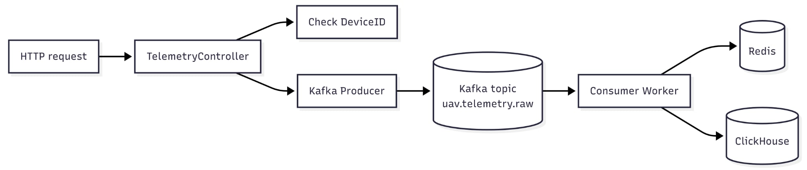
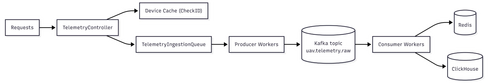
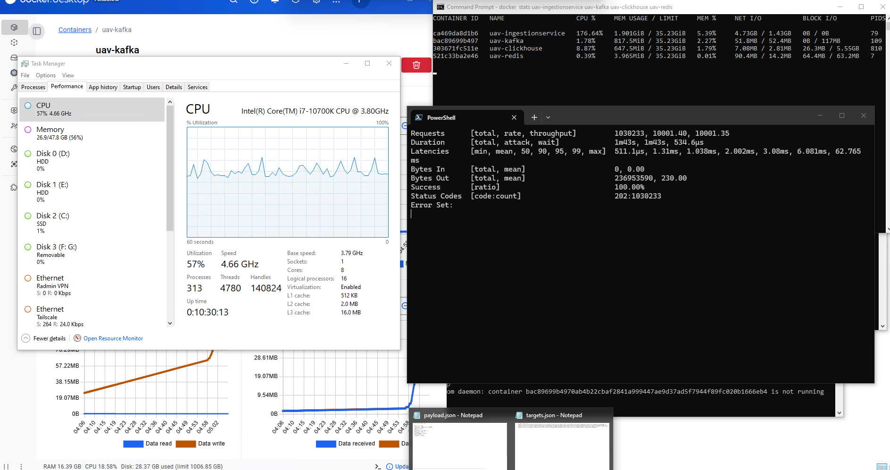
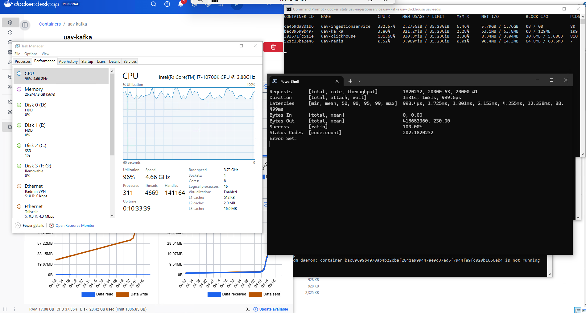
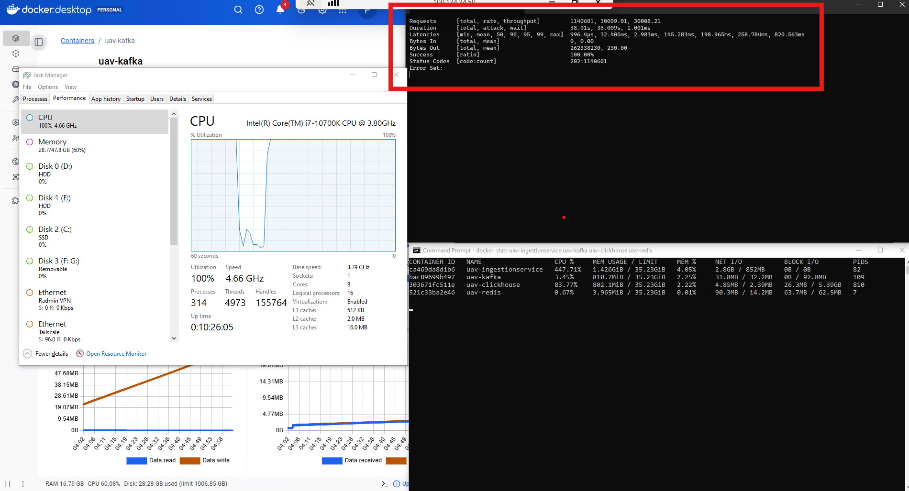

# Homework: Tăng tải trên Service nhận telemetry

## 1. Mục tiêu

Hiện tại service nhận telemetry của em xử lí được khoảng 3000 request/s và hệ thống sẽ chạy chậm hơn khi cho lên 10000 request/s. Do đó yêu cầu là phải tối ưu service nhận telemetry của em sao cho có thể xử lí được trên 20000 request/s.

Phạm vi: Homework của em chỉ tối ưu phần service nhận telemetry để đạt hiệu suất tối đa, không động tới scale thêm nhiều instance của service nhận telemetry không được tính. Hoạt động tăng tải chỉ diễn ra trong folder [IngestionService](src/IngestionService/).

**Kết quả đạt được** Sau quá trình chỉnh sửa lại, service nhận telemetry lên mức chạm ngưỡng 30000-35000 request/s.

<video src="img_homework/lab_30000.mp4" controls width="100%"></video>

https://github.com/user-attachments/assets/a7b014b3-4227-4dec-b525-ccb8b129f4b3

## 2. Điểm yếu của code cũ (anh có thể check lại trong branch kafka):



- Thiết bị gửi telemetry lên endpoint `/api/v1/telemetry/log`.
- IngestionService nhận request, kiểm tra deviceID tạo thành payload và gửi xuống Kafka producer với topic `uav.telemetry.raw` rồi mới gửi response 202 -> Mục đích để đảm bảo telemetry được gửi xuống kafka, tuy nhiên lại gây ra độ trễ cho request.
- Worker phía dưới consume theo batch để lưu vô Clickhouse, đồng thời update latest log hoặc trạng thái thiết bị trên Redis.

## 3. Thiết kế mới

### 3.1 Flow tổng quan



### 3.2 Controller khong publish Kafka trực tiếp nữa

Controller mới không gọi Kafka producer trực tiếp. Thay vào đó, controller chỉ đưa telemetry vào `TelemetryIngestionQueue` (được lưu trong RAM) sau đó trả `202` ngay cho client, tránh bị phụ thuộc vào Kafka.

### 3.3 Producer Consumer

`ProducerWorker` là một `BackgroundService` chạy nhiều asynchronous worker loop song song để đọc telemetry từ `TelemetryIngestionQueue` và publish message sang Kafka. Thay vì để `TelemetryController` gọi Kafka trực tiếp trong HTTP request path, controller chỉ enqueue `LogPacket` vào queue trong RAM rồi trả `202`, còn `ProducerWorker` xử lý Kafka ở background. Cách này áp dụng mô hình producer-consumer và asynchronous buffering, giúp tăng tốc độ nhận request và giảm độ phụ thuộc của HTTP latency vào Kafka latency.

`ProducerWorker` áp dụng mô hình nhiều asynchronous worker loop chạy song song trên .NET ThreadPool. Các worker này có thể được scheduler phân phối lên nhiều CPU core khác nhau, giúp tăng tốc độ drain queue và publish Kafka so với chỉ dùng một vòng lặp xử lý duy nhất.

```csharp
        var workers = Enumerable.Range(0, _workerCount)
            .Select(workerId => RunProducerLoopAsync(workerId, stoppingToken));
        await Task.WhenAll(workers);
```

ConsumerWorker ConsumerWorker gom message từ Kafka vào một batch trong bộ nhớ. theo mẻ cực lớn với cấu hình BatchSize = 20000 bản tin hoặc kích hoạt ngắt thời gian chờ sau mỗi BatchTimeoutMs = 1000 (1 giây) rồi bulk insert

## 3. Tiến hành benchmark

### 3.1 Yêu cầu:

- Như đã bàn ở cuộc phỏng vấn, em sẽ cố để đẩy lượng tps lên cao nhất có thể tới khi CPU đã chạm ngưỡng
- Em sẽ benchmark trên một máy duy nhất có hệ thống em đang chạy
- Qua quá trình thử nhiều lần, em nhận ra dùng code Python sẽ không thể nào đáp ứng được việc gửi các burst 10-20k request/s. Do đó em quyết định tìm kiếm tool cho benchmark và em chọn Vegeta.exe:
  https://github.com/tsenart/vegeta
  https://sourceforge.net/projects/vegeta.mirror/

## 3.2 Benchmark kết quả:

Máy em sử dụng có cấu hình i7 CPU 16Core 16GB RAM

### 1. Test với 10000TPS:



Hệ thống hoạt động ổn định, CPU vẫn hoạt động bình thường khoảng 50%, không có gói tin nào bị mất. Do đó chúng ta tiến hành đẩy lên mức tps cao hơn.

### 2. Test với 20000TPS:



Hệ thống hoạt động vẫn ổn định, không có gói tin nào bị mất. CPU đã chạm ngưỡng từ 85% tới 99%. Do đó, chúng tiếp tục tăng mức tps.

### 3. Test với 30000TPS:

Để có cái nhìn trực quan hơn, em đã quay lại video quá trình benchmark này:
<video src="img_homework/lab_30000.mp4" controls width="100%"></video>

https://github.com/user-attachments/assets/0221dbab-5f79-4b3d-9499-0b7254952143



CPU đã chạm ngưỡng 100%, rất có thể khi chạy lâu hơn nữa, hệ thống sẽ hoàn toàn vượt ngưỡng.

### 4. Test với 35000TPS:

Tiếp tục đặt ngưỡng cao hơn, hiện tượng quá tải diễn ra rất nhanh:

<video src="img_homework/lab_35000.mp4" controls width="100%"></video>

https://github.com/user-attachments/assets/8fcf21b2-3dcf-4dde-bcbc-f69c2621f657

## 4. Lời kết

Cảm ơn anh đã xem tới phần này ạ, bài tập này có thể em chưa làm được ở mức tốt nhất và tối ưu nhất trong thời gian ngắn, em mong sẽ được anh đóng góp ý kiến để em có thể hoàn thiện hơn trong tương lai ạ.
